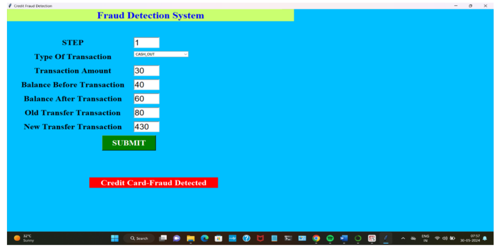
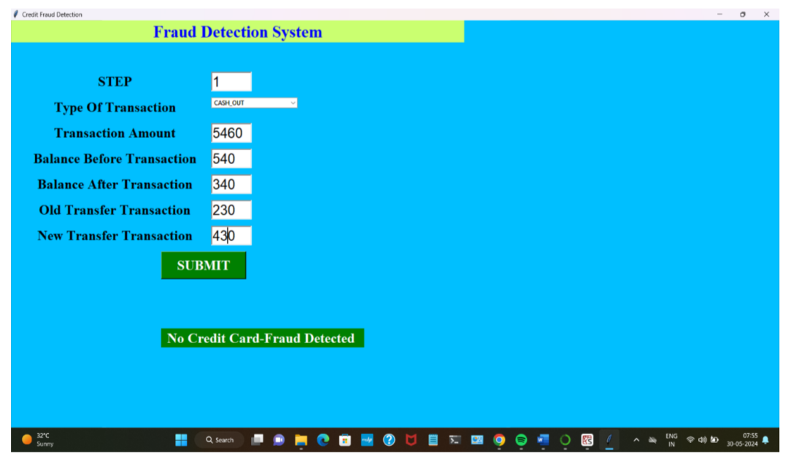

# Credit-Card-Fraud-Detection-using-Machine-Learning

A final year engineering project submitted in partial fulfillment of the Bachelor of Engineering (Computer Engineering) under **Savitribai Phule Pune University**.

---

## 📌 Abstract

Credit card fraud poses a serious threat to the global financial sector, with billions lost annually. This project leverages **machine learning algorithms** to detect anomalies in real-time transaction data. The system combines supervised learning, biometric authentication, and data analytics to accurately identify fraudulent activity while minimizing false positives.

---

## 🎯 Objectives

- Detect and prevent fraudulent transactions using ML.
- Provide a secure, user-friendly interface.
- Reduce financial loss and improve fraud investigation systems.
- Adapt to changing fraud patterns via continuous learning.

---

## ❓ Problem Statement

To build a machine learning model capable of distinguishing between **genuine** and **fraudulent** credit card transactions, with **high accuracy**, **low false positives**, and **low false negatives**.

---

## 💡 Motivation

- Prevent financial losses for individuals and institutions.
- Ensure consumer trust in digital transactions.
- Adapt to evolving fraud strategies using AI and real-time analysis.

---

## 🧰 Tech Stack

| Component        | Technology           |
|------------------|----------------------|
| Language         | Python 3.5+          |
| IDE              | Spyder (Anaconda)    |
| Libraries        | NumPy, Pandas, Scikit-learn, Matplotlib, Seaborn |
| GUI              | Python Tkinter       |
| ML Model         | Support Vector Machine (SVM) |
| Database         | SQLite               |
| OS               | Windows 10+          |

---

## 🧠 Algorithms & Approach

- **Supervised Learning** (SVM)
- Real-time decision-making
- Waterfall SDLC model followed
- Secure login and admin approval system

---

## 🏗️ System Modules

### 🔑 Admin Module
- Authorize new users
- Manage transaction dataset
- View logs and prediction results

### 👤 User Module
- Register and login securely
- Enter transaction details
- Get fraud detection prediction

### 🧠 Detection Module
- Trained ML model (SVM)
- Predicts whether transaction is fraud or legitimate
- Displays result to user in GUI

---

## 🎨 GUI Screenshots

### 🔐 Login Page

### 📝 Registration Page

### 📊 Fraud Detection Output

## 📊 System Requirements

- **OS**: Windows 10 or higher
- **RAM**: Minimum 8 GB
- **Python Version**: 3.5+
- **IDE**: Spyder (via Anaconda)
- **Libraries**: Listed in `requirements.txt`
- **Database**: SQLite

---

## ✅ How to Run

### 1. Clone the Repository

git clone https://github.com/SakshamCloudOps/Credit-Card-Fraud-Detection.git
cd Credit-Card-Fraud-Detection

### 2. Create and Activate Environment

conda create -n fraud_env python=3.8
conda activate fraud_env

### 3. Install Requirements

pip install -r requirements.txt

### 4. Launch the App

src/GUI_main.py

### 🧪 Testing Strategy
✅ Unit Testing

✅ Integration Testing

✅ GUI Testing

✅ Black-box & White-box Testing

Test coverage includes login, registration, data input, and fraud output classification.

### 📈 Results
Model used: Support Vector Machine (SVM)

Achieved accuracy: ~99%

Real-time fraud detection with simple GUI

Adaptable to new fraud patterns

### 📚 References
Kaggle Dataset - Credit Card Fraud Detection

### 👨‍💻 Authors
Saksham S. Kamble

### 🏁 Conclusion
This project demonstrates a practical implementation of machine learning for fraud detection in financial systems. With a user-friendly interface and real-time predictions, it offers a reliable approach to identify suspicious activities and protect consumers from financial fraud.
